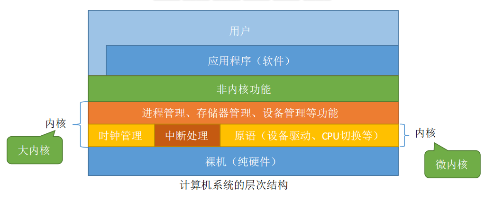

# 概述

- 

# ==内核==

## Remind

- 操作系统最基本、最核心部分。内核功能的程序就是==内核程序==

## 内核功能

### 时钟管理

### 中断处理

### 原语

#### 特征

- 处于操作系统的底层，是最接近硬件的部分
- 运行具有原子性，操作只能一气呵成
- 运行时间较短，且调用频繁

### 资源管理

## 内核结构

- |          | 特性、思想                                                   | 优点                                                         | 缺点                                                         |
  | -------- | ------------------------------------------------------------ | ------------------------------------------------------------ | ------------------------------------------------------------ |
  | 分层结构 | - 内核分多层，每层可单向调用更低一层提供的接口               | - ==便于调试和验证，自底向上逐层调试验证== - 易扩充和维护，各层之间调用接口清晰固定 | - 仅仅可调用相邻低层，难以合理定义各层的边界 - ==效率低，不可跨层调用，系统调用执行时间长== |
  | 模块化   | - ==将内核划为多个模块，各模块之间相互协作== - ==内核=主模块+可加载内核模块== - ==主模块：只负责核心功能== - ==可加载模块：可以动态加载新模块到内核，而无需重新编译整个内核== | - 模块间逻辑清晰易于维护，确定模块间接口后即可多模块同时开发 - ==支持动态加载新的内核模块，增强OS适应性== - ==任何模块都可以直接调用其他模块，无需采用消息传递进行通信，效率高== | - 模块间的接口定义未必合理、实用 - 模块间相互依赖，更难调试和验证 |
  | 宏内核   | - 将操作系统的主要功能模块都作为系统内核，运行在核心态（大内核结构的OS通常也采用了“模块化”的设计思想） | - 性能高，内核内部各种功能都可以直接相互调用                 | - ==内核庞大功能复杂，难以维护== - ==大内核中某个功能模块出错，就可能导致整个系统崩溃== |
  | 微内核   | - 只把最基本的功能保留在内核                                 | - ==内核小功能少、易于维护，内核可靠性高== - ==内核外的某个功能模块出错不会导致整个系统崩溃== | - ==性能低，需要频繁地切换用户态/核心态。用户态下的各功能模块不可直接相互调用，只能通过内核的“消息传递”来间接通信== |
  | 外核     | - ==内核负责进程调度、进程通信等功能，外核负责为用户进程分配未经抽象的硬件资源，且由外核保证资源使用安全== | - ==外核可直接给用户进程分配“不虚拟、不抽象”的硬件资源，使用户进程可以更灵活的使用硬件资源== - ==减少了虚拟硬件资源的“映射层”，提升效率== | - 降低了系统的一致性 - 是系统变得复杂                    |

