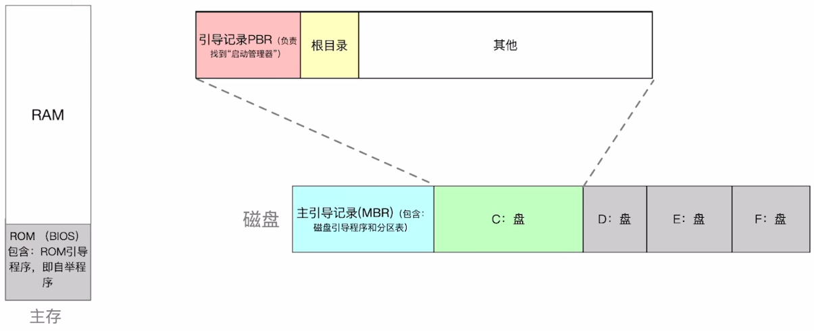

# 概述

- > 完成“开机”的一系列动作

- 计算机的主存由ROM和RAM两部分组成，ROM芯片被集成在主板上，里面存储BIOS（Basic Input/Output System）基本输入输出系统，BIOS由一系列程序组成，其中最重要的是ROM引导程序

- 

# ==电脑启动过程==

0. 硬件加电
    - 电源稳定：主板供电电路等待电压稳定，随后触发CPU复位
    - CPU复位状态：寄存器清零（`CS:IP`=`0xF000:0xFFF0`，实模式）。禁止中断（`IF`=`0`），无分页/保护模式
1. CPU初始指令获取
   1. 第一条指令地址：x86架构CPU强制将`CS:IP`指向`0xFFFFFFF0`（32位）或`0xFFFFFFFFFFF0`（64位），即复位向量。此地址位于主板ROM的映射区域，非实际物理内存
   2. 跳转至ROM代码：CPU执行ROM中的第一条指令（通常是`JMP`到固件入口点）
2. 进入BIOS
   1. 固件（BIOS/UEFI）的早期初始化：基本硬件的初始化。此时会完成内存最基本的初始化，将BIOS代码拷贝到RAM，==BIOS在RAM上运行==
   2. 固件运行服务准备：建立中断向量表，BIOS数据区
   3. POST（加电自检）：验证硬件是否满足最低运行条件
   4. 引导设备选择与加载：查找可启动设备（硬盘等等），找到后读取第一扇区并执行（也就是MBR），后续详见 [文件系统.md](..\-004-文件管理\文件系统.md) 中文件系统布局
3. 初始化操作系统
4. 用户登录

# Tip

- 根据引导过程可知，BIOS在未完成内存最基本的初始化之前是在ROM上运行，完成最基本的硬件初始化后会将BIOS代码拷贝到RAM上，在RAM上继续运行