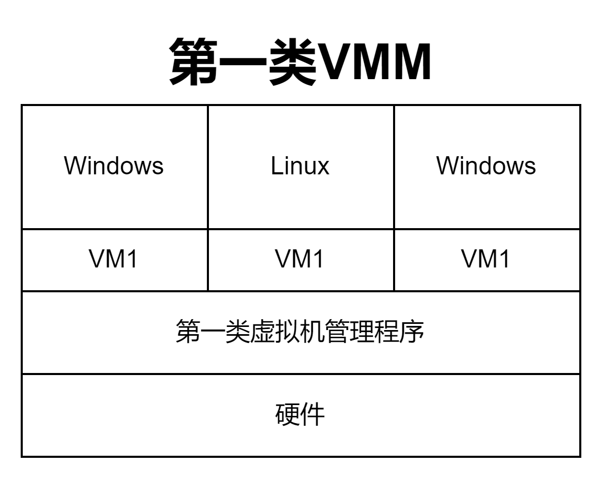
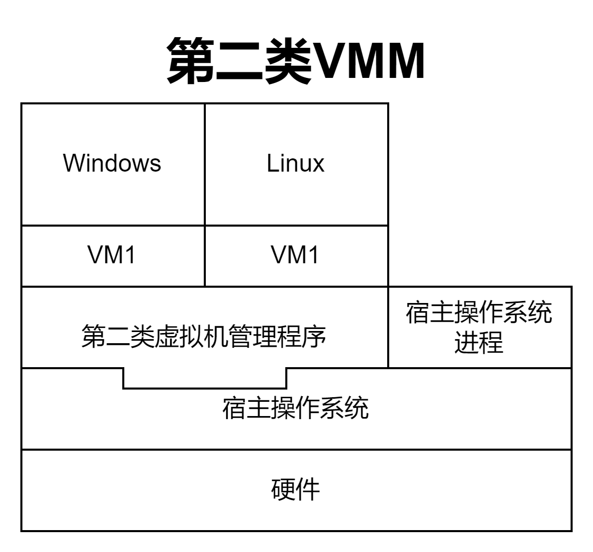

# 基本概念

## 第一类虚拟机管理程序

- 
- 直接运行在硬件上，因为主要功能是管理虚拟机和硬件，所以完全运行在内核态

## 第二类虚拟机管理程序

- 
- ==部分运行在用户态，部分运行在内核态==

## Tip

### 两类虚拟机管理程序对比

- |                    | 第一类VMM                                                    | 第二类VMM                                                    |
  | ------------------ | ------------------------------------------------------------ | ------------------------------------------------------------ |
  | 对物理资源的控制权 | 直接运行在硬件之上，能直接控制和分配物理资源                 | 运行在Host OS之上，依赖于Host OS为其分配物理资源             |
  | 资源分配方式       | 在安装Guest OS时，VMM要在原本的硬盘上自行分配存储空间，类似与“外核”的分配方式，分配未经抽象的物理硬件 | Guest OS拥有自己的虚拟磁盘，该盘实际上是Host OS文件系统中的一个大文件。Guest OS分配到的内存是虚拟内存 |
  | 性能               | 性能更好                                                     | 性能更差，需要Host OS作为“中介”                              |
  | 可支持的虚拟机数量 | 更多，不需要和Host OS竞争资源，相同的硬件资源可以支持更多的虚拟机 | 更少，Host OS本身需要使用物理资源，Host OS上运行的其他进程也需要物理资源 |
  | 虚拟机的可迁移性   | 更差                                                         | 更好，只需要导出虚拟机镜像文件即可迁移到另一台Host OS上，商业化应用更广泛 |
  | 运行模式           | 第一类VMM运行在最高特权级（Ring 0），可以执行最高特权的指令  | 第二类VMM部分运行在用户态、部分运行在内核态。Guest OS发出的系统调用会被VMM截获并转化为VMM对Host OS的系统调用 |