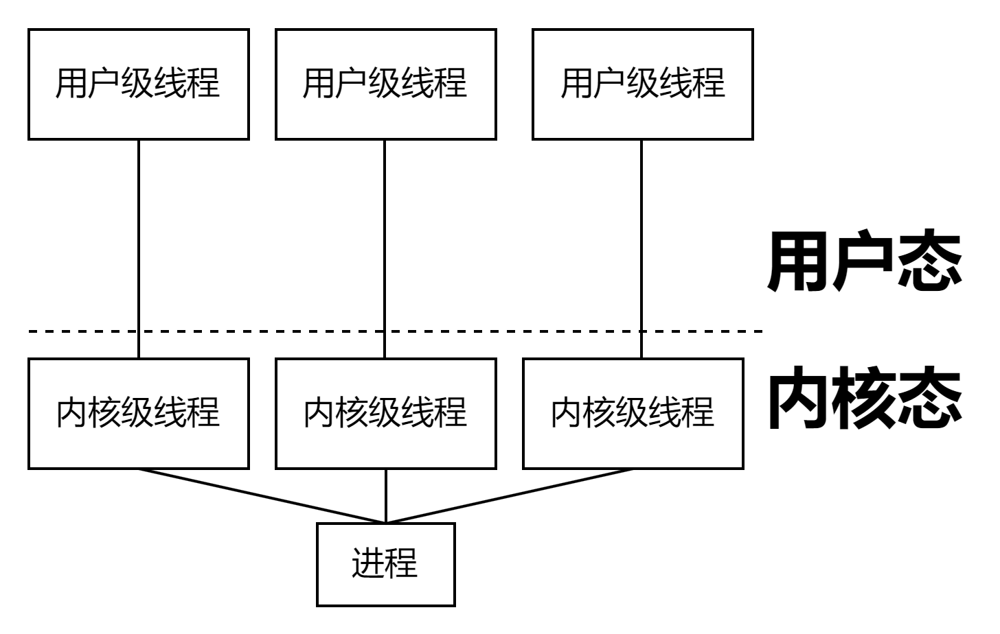

# 基本概念

- > ==基本的CPU执行单元==，也是==程序执行流的最小单位==

# 线程与进程的比较
## 资源分配、调度

- 传统进程机制中，进程是资源分配、调度的基本单位
- ==引入线程后==，进程是==资源分配==的基本单位，线程是==调度==的基本单位

## 并发性

- 传统进程机制中，只能进程间并发
- ==引入线程后==，各线程间也能并发，==提升了并发度==

## 系统开销

- 传统的进程间并发，需要切换进程的运行环境，系统开销很大
- ==引入线程后==，线程间并发，如果是同一进程内线程切换，则不需要切换进程环境，系统开销小

# 属性

- 线程是处理机调度的单位
- 多CPU计算机中，各个线程可占用不同的CPU
- 每个线程都有一个线程ID、线程控制块（TCB）
- 线程也有就绪、阻塞、运行三种基本状态
- 线程几乎不拥有系统资源
- 同一进程的不同线程间共享进程的资源
- ==由于共享内存地址空间，同一进程中的线程间通信甚至无需系统干预==
- 同一进程中的线程切换，不会引起进程切换
- 不同进程中的线程切换，会引起进程切换
- 切换同进程内的线程，系统开销很小
- 切换进程，系统开销很大

# 状态

## 执行态

## 就绪态

## 阻塞态

# 组织
## 线程控制块（TCB，Thread Control Block）

### Remind

- > 线程存在的唯一标志

### 线程标识符（TID）

- ==程序计数器PC==：线程目前执行到哪里
- ==其他寄存器==：线程运行的中间结果
- ==堆栈指针==：堆栈保存函数调用信息、局部变量等
- 线程运行状态：运行/就绪/阻塞
- 优先级：线程调度、资源分配的参考

## 线程表（Thread Table）

- > 线程切换时要保存/恢复

# 实现方式

## 用户级线程

- > 从用户视角能看到的线程，由线程库实现（==用户态==）

## 内核级线程

- > 从操作系统视角看到的线程，由操作系统实现（==内核态==）（==内核级线程才是处理机分配的单位==）

## 组合方式

- > 上述两种方式结合

# 多线程模型

- | 模型       | 描述                                     | 优点                                         | 缺点                               | 模型示意图                                                   |
  | ---------- | ---------------------------------------- | -------------------------------------------- | ---------------------------------- | ------------------------------------------------------------ |
  | 多对一模型 | 多个用户级线程映射到一个内核级线程       | 线程管理开销小效率高                         | 一个线程阻塞会导致整个进程都被阻塞 |  |
  | 一对一模型 | 一个用户级线程映射到一个内核级线程       | 各个线程可分配到多核处理机并行执行，并发度高 | 线程管理都需要操作系统支持，开销大 |  |
  | 多对多模型 | n个用户级线程映射到m个内核级线程（n>=m） | 集二者之所长                                 | \                                  |  |

- 对于多对多模型可以这么理解

  - 用户级线程是“代码逻辑”的载体
  - 内核级线程是“运行机会”的载体
  - ==内核级线程才是处理机的分配单位==，一段“代码逻辑”只有获得了“运行机会”才能被CPU执行