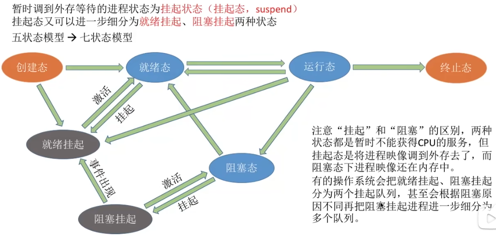

# 基本概念

- > 按照某种算法选择一个进程将处理机分配给它

# 层次

- 作业：一个具体任务，用户向系统提交一个作业≈用户让操作系统启动一个程序（来处理一个具体的任务）

- | 层次                                                         | 要做什么                                                     | 调度产生位置                | 发生频率 | 对进程状态的影响                         |
  | ------------------------------------------------------------ | ------------------------------------------------------------ | --------------------------- | -------- | ---------------------------------------- |
  | 高级调度（==作业调度，每个作业只调入（建立PCB）一次，调出（撤销PCB）一次==） | 按照某种规则，从后备队列中选择合适的作业将其调入内存，并为其创建进程 | ==外存->内存 （面向作业）== | 最低     | - 无->创建态->就绪态                     |
  | 中级调度（==内存调度==）                                     | 按照某种规则，从挂起队列中选择合适的进程将其数据调回内存     | ==外存->内存（面向进程）==  | 中等     | - 挂起态->就绪态 - 阻塞挂起->阻塞态 |
  | 低级调度（==进程调度==）                                     | 按照某种规则，从就绪队列中选择一个进程为其分配处理机         | ==内存->CPU==               | 最高     | - 就绪态->运行                           |

- 为了减轻系统负载，提高资源利用率，暂时不执行的进程会被调到外存从而变为“挂起态”

- 七状态模型

  - 在五状态模型的基础上加入了“就绪挂起”和“阻塞挂起”两种状态
  - 

# 调度的时机

## Remind

- > ==需要进行==进程调度与切换的情况

- ==进程调度==（低级调度），就是按照某种算法从就绪队列中选择一个进程为其分配处理机

## ==主动放弃==处理机

- 进程正常终止
- 运行过程中发生异常而终止
- 主动阻塞（如等待I/O）
- Tip：有的系统只允许进程主动放弃处理机

## ==被动放弃==处理机

- 时间片用完
- 有更要紧的事情处理
- 有更高优先级的进程进入就绪队列

## 禁止调度的情况

- ==处理中断过程中==。中断处理过程复杂，与硬件密切相关，很难做到在中断处理过程中进行进程切换
- 进程在==操作系统内核程序临界区中==（在非内核程序临界区是可以的）
- ==原子操作过程中==

# ==进程调度（狭义）==

- > 从就绪队列中==选中一个要运行的程序==

# ==进程切换==

## Remind

- > 一个进程让出处理机，由另一个进程占用处理机的过程

- 进程切换的过程主要完成了

  - 对原来运行进程各种数据的保存
  - 对新的进程各种数据的恢复

## 上下文切换

- 只能发生在内核态，必然切换当前进程

## 模式切换（系统调用）

- 用户态和内核态之间的切换，可能不切换当前进程

## Tip

- ==进程切换是有代价的==，因此==过于频繁==的进程==调度、切换==，必然会使整个==系统的效率降低==

# ==调度的过程==

1. 进程调度（狭义）
2. 进程切换

# 方式

## ==非剥夺调度方式==（==非抢占式==）

- > 等待进程主动放弃CPU的使用权

## ==剥夺调度方式==（==抢占式==）

# 调度程序

## Remind

- 让谁运行：调度算法
- 运行多长时间：时间片大小

## 调度算法

### Remind

#### 饥饿

- > 作业/进程长时间得不到服务的现象

#### 饿死

- > 一直得不到服务

### 算法1

- | 算法                                                         | 算法规则                                                     | 是否抢占 | 优点                       | 缺点                                                         | 是否考虑到等待时间 | 是否考虑到运行时间 | 是否产生饥饿 |
  | ------------------------------------------------------------ | ------------------------------------------------------------ | -------- | -------------------------- | ------------------------------------------------------------ | ------------------ | ------------------ | ------------ |
  | ==先来先服务调度算法==（==FCFS==，First Come First Serve）   | 按照作业/进程==到达的先后顺序==进行服务                      | 否       | 公平、算法简单             | 对长作业有利，对短作业不利                                   | 是                 | 否                 | 不会         |
  | ==短作业/进程优先调度算法==（==SJF==、==SPF==，Shortest Job/Process First） | ==要求服务时间最短==的作业/进程优先得到服务                  | 否       | “最短的”平均等待/周转时间  | - 对长作业不利，可能导致饥饿 - 难以做到真正的短作业优先 | 否                 | 是                 | 会           |
  | ==最短剩余时间优先调度算法==（==SRTN==，Shortest Remaining Time Next。抢占式的短作业/进程优先调度算法） | ==剩余要求服务时间最短==的作业/进程优先得到服务              | 是       | “最短的”平均等待/周转时间  |                                                              | 否                 | 是                 | 会           |
  | ==高响应比优先调度算法==（==HRRN==，Highest Response Ratio Next） | - 每次调度时先计算各个作业/进程的==响应比==，选择==响应比最高==的作业/进程为其服务 - ==响应比 =（等待时间 + 要求服务时间）÷ 要求服务时间== | 否       | 综合考虑等待时间和运行时间 |                                                              | 是                 | 是                 | 不会         |

- 这几种算法主要关心对用户的公平性、平均周转时间等评价系统整体性能的指标，但是不关心“响应时间”，也不区分任务的紧急程度，对于用户而言，交互性很糟糕，适用于早期的批处理系统。早期计算机性能不足，主要面向性能设计

### 算法2

- | 算法                         | 算法规则                                                     | 是否抢占 | 优点                                                     | 缺点                           | 是否产生饥饿 | 补充                                                         |
  | ---------------------------- | ------------------------------------------------------------ | -------- | -------------------------------------------------------- | ------------------------------ | ------------ | ------------------------------------------------------------ |
  | ==时间片轮转调度算法（RR）== | 按照到达队列的先后顺序，轮流执行一个时间片                   | 是       | - 每个进程都能被及时响应 - 公平、适用于==分时系统== | 频繁切换开销大，不区分优先级   | 不会         | 时间片大小会有影响                                           |
  | ==优先级调度算法==           | 选择优先级最高的进程                                         | 均可     | 区分优先级，适用于==实时系统==                           | 可能会导致饥饿                 | 会           | - 动态/静态优先级 - 各类型进程如何设置优先级？如何调整优先级？ |
  | ==多级反馈队列调度算法==     | 1. 设置多级队列，队列优先级从高到低，时间片从小到大 2. 每个队列采用FCFS算法 3. 若执行完时间片，则放入下一队列。若==被抢占==，则放入==原有队列队尾== | 是       | 平衡优秀                                                 | 一般不会说优缺点，但会导致饥饿 | 会           |                                                              |

### 评价指标

#### ==CPU利用率==

- > CPU“忙碌”的时间占总时间的比例

- ==利用率== = 忙碌时间 ÷ 总时间

#### ==系统吞吐量==

- > 单位时间内完成的作业数量

- ==系统吞吐量== = 总共完成了多少道作业 ÷ 总共花了多少时间

#### ==周转时间==

- > 作业被提交给系统开始，到作业完成为止的这段时间间隔

- 包括的四个部分

  - 作业在外存后备队列上等待作业调度（高级调度）的时间、
  - 进程在就绪队列上等待进程调度（低级调度）的时间
  - 进程在CPU上执行的时间
  - 进程等待I/O操作完成的时间
  - Tip：后三项在一个作业的整个处理过程中，可能发生多次

- ==周转时间== = 作业完成时间 - 作业提交时间

- ==平均周转时间===各作业周转时间之和 ÷ 作业数

- ==带权周转时间===作业周转时间 ÷ 作业实际运行时间

- ==平均带权周转时间===各作业带权周转时间 ÷ 作业数

#### ==等待时间==

- > 指进程/作业==处于等待处理机状态时间之和==

- 对于==进程==来说，等待时间指的是进程建立后==等待被服务时间之和==，在等待I/O完成的时期其实进程也是在被服务的，所以不计入等待时间

- 对于==作业==来说，不仅考虑==建立进程后的等待时间，还要加上作业在外存后备队列中等待的时间==

- ==平均等待时间==

#### ==相应时间==

- > 用户==提交请求==到==首次产生响应==所用的时间

### Tip

- FCFS常用，现在也扮演者很重要的角色
- 在==所有进程都几乎同时到达==时，SJF调度算法的平均等待时间、平均周转时间最少。若==不加上上述条件==，则SRTN算法的平均等待时间、平均周转时间最少。即常态化使用SRTN算法的平均等待时间、平均周转时间最少
- 操作系统更==偏好I/O型进程（I/O繁忙型进程）==，而相对的==计算型进程（CPU繁忙型进程）==

## 触发调度程序的事件（调度时机）

- ==创建新程序==
- ==进程退出==
- 运行==进程阻塞==
- ==I/O中断发生==
- 抢占式策略==时钟中断==

# 闲逛程序

## Remind

- 操作系统中的一个特殊进程，当系统没有任何其他可运行的进程时，调度器会将CPU的控制权交给这个进程。闲逛进程的主要目的是确保在没有任务可执行的情况下，CPU不会空转，从而防止CPU进入不受控制的状态

## 特性

- 优先级最低
- 可以是0地址指令，占一个完整的指令周期（指令周期末尾例行检查中断）
- 能耗低

