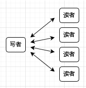
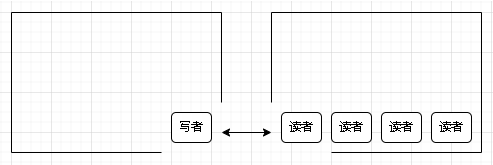

# 概念

## ==临界资源==

- > 一段时间内只允许一个进程使用的可==共享==资源

## 进程同步

- ==异步性==：并发执行的进程以各自独立的、不可预知的速度向前推进
- 并发性带来了异步性，有时需要通过进程同步解决这些一步问题。有的进程之间需要相互配合地完成工作，各工作的工作推进需要遵循一定的先后顺序
- ==同步==亦称==直接制约关系==，它是指为完成某种任务而建立的两个或多个进程，这些进程因为需要在某些位置上==协调==它们的==工作次序==而产生制约关系。进程间的直接制约关系就是源于他们之间的相互合作（==基于互斥==，实现==有序==访问。但同步并不互斥）

## 进程互斥

- ==互斥==亦称==间接制约关系==，访问临界资源
  - 进入区：实现互斥
  - 临界区：访问临界资源的代码
  - 退出区：实现互斥
  - 剩余区
- 原则
  - 空闲让进
  - 忙则等待
  - 有限等待：要在有限的时间内进入临界区，保证不会饥饿
  - 让权等待：进不了临界区的进程，要释放处理机，防止忙等

# 实现方法

## 软件实现方法

### 单标志法

- 在进入区只做“检查”（这个检查甚至不是检查有没有资源，而是检查自己能不能使用资源，并且每个进程进入临界区的权限只能被另一个程序赋予），不“上锁”
- 在退出区把临界区的使用权转交给另一个进程（给其他程序“解锁”，给自己“上锁”）
- 主要问题：不遵循“空闲让进”

### 双标志先检查法

- 在进入区先“检查”后“上锁”，退出区“解锁”
- 主要问题：不遵循“忙则等待”（并发进程）

### 双标志后检查法

- 在进入区先“加锁”后“检查”，退出区“解锁”
- 主要问题不遵循“空闲让进、有限等待”原则，可能饥饿（死锁）

### Peterson算法

- 在进入区“主动争取——主动谦让——检查对方是否想进，己方谦让”
- 不遵循“让权等待”原则，会忙等

## 硬件实现方法

### 中断屏蔽方法

- 使用“开/关中断”指令实现（也就是不能发生进程切换）
- 优点：简单高效
- 缺点：不适用于多处理机；只适用于操作系统内核进程，不适用于用户进程（因为中断指令只能运行在内核态）

### TestAndSet（TS/TSL指令）（原语）（==TSL指令用硬件实现的==）

- old记录是否已被上锁；再将lock设为true；检查临界区是否已被上锁（若已上锁，则循环重复）
- 优点：实现简单；适用于多处理机环境
- 缺点：不满足“让权等待”

### Swap指令（XCHG指令）

- 逻辑上同TSL

### 硬件实现的优点

- 简单、容易验证其正确性
- 适用于任意数目的进程，支持多处理器系统
- 支持系统中有多个临界区，只需为每个临界区设立一个布尔变量

### 硬件实现的缺点

- 等来进入临界区的进程会占用CPU执行while循环，不能实现“让权等待”
- 从等待进程中选择一个进程进入临界区，有的进程可能一行字选不上，从而导致“饥饿”

# 信号量机制

## 整型信号量

- 用一个整数型变量作为信号量，数值表示某种资源数
- 整型信号量与普通信号量的区别：对信号量只能执行初始化、P、V三种操作
- 整型信号量存在问题：不满足让权等待原则

## 记录型信号量
- S.value表示某种资源数，S.L指向等待该资源的队列
- P操作中，一定是先S.value--，之后可能需要执行block原语
- V操作中，一定是先S.value++，之后可能需要执行wakeup原语
- 注意：要能够自己判断在什么条件下需要执行block和wakeup
- 可以用记录型信号量实现系统资源的“申请”和“释放”
- 可以用记录型信号量实现进程互斥、进程同步

## 实现进程互斥
- 分析问题，确定临界区
- 设置互斥信号量，初值为1
- 临界区之前对信号量执行P操作
- 临界区之后对信号量执行V操作

## 实现进程同步
- 分体问题，找出哪里需要实现“一前一后”的同步关系
- 设置同步信号量，初始值为0
- 在“前操作”之后执行V操作
- 在“后操作”之前执行P操作

## 实现进程的前驱关系
- 分析问题，画出前驱图，把每一对前去关系都看成一个同步问题
- 为每一对前驱关系设置同步信号量，初值为0
- 在每个“前操作”之后执行V操作
- 在每个“后操作”之前执行P操作

# 经典问题

## 简化版读写者问题

- 一个读者，多个写者
- 多个读者可同时工作
- 写者工作时读者不能工作
- 写者优先
  - 即读者群体与写者群体之间有信号量
    
  - 所以我们将其转化为写者池与读者池之间的关系，并且只对池中第一个和最后一个读者或写者，进行读者与写者之间互斥信号量的变更（也就是访问权的交换）
    
  - 因此对读者或写者进行计数，只有池数量为0时才能进行读者与写者之间互斥信号量的变更（也就是访问权的交换）
  - 又为了防止在对池数量判断时，因为线程并发而导致的问题。添加对池数量访问的信号量（保证只有只有一个线程对池数量访问）保证访问池数量的互斥性
  - 最后优先问题，就是控制对方的池数量添加的信号量（也就是对池数量增加的权限），赶紧让剩下的都执行掉更换访问权

# 管程

## Remind

- 为什么要引入管程：解决信号量机制编程麻烦、易出错的问题
- ==管程的内部空间是安全的：管程就是利用互斥来创造一个稳定的不被并发影响的内部环境，使得就算不是原语也可以安全的对数据操作，不担心并发。不是原语胜似原语==

## 组成

- 管程的名称
- 共享数据结构
- 对数据结构初始化的语句
- 一组用来访问数据结构的过程（函数）

## 基本特征

- ==各外部进程/线程只能通过管程提供的特定“入口”才能访问共享数据==（封装的思想）
- ==每次仅允许一个进程在管程内执行某个内部过程==

## 条件变量

- 用于保存等待队列，否则进入管程的进程被阻塞，不会释放管程（定义上更像是条件产生的结果，并不是条件，信号量还是那个条件）
- 条件变量的==wait/signal原语只负责阻塞和唤醒==，不再像信号量中的P/V操作那样的加减资源数了
- 与信号量比较
- 相似点：==wait/signal同样拥有实现进程的阻塞唤醒的功能==（因为在管程中已经是互斥的状态所以管程内部本身就是独立的环境，对内部数值操作无须担心并发，PV因为环境不安全，所以必须在内部对信号量和进程状态操作）
- 不同点：==条件变量“没有值”，只用于实现“排队等待”==（因为管程只用信号量会导致管程陪着进程一起阻塞），信号量“有值”。也就是信号量中的PV的核心操作是对信号量的加减，而条件变量的wait和signal不负责这一道了，因为管程内部空间是安全的
- 信号量（也就是剩余资源）保存在共享数据结构中

## 补充

- 各进程必须互斥的访问管程的特性是==由编译器实现==的，不过底层依旧是编译器借助系统调用的原语去实现的
- 可在管程中设置条件变量及等待/唤醒操作以解决同步问题