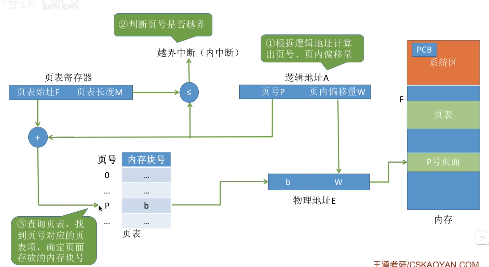
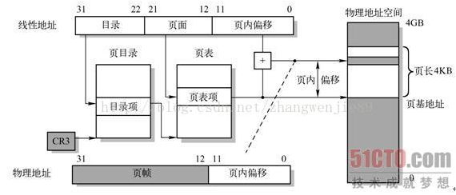
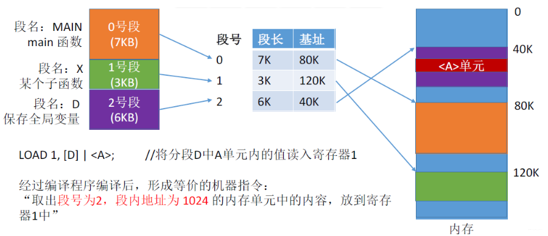
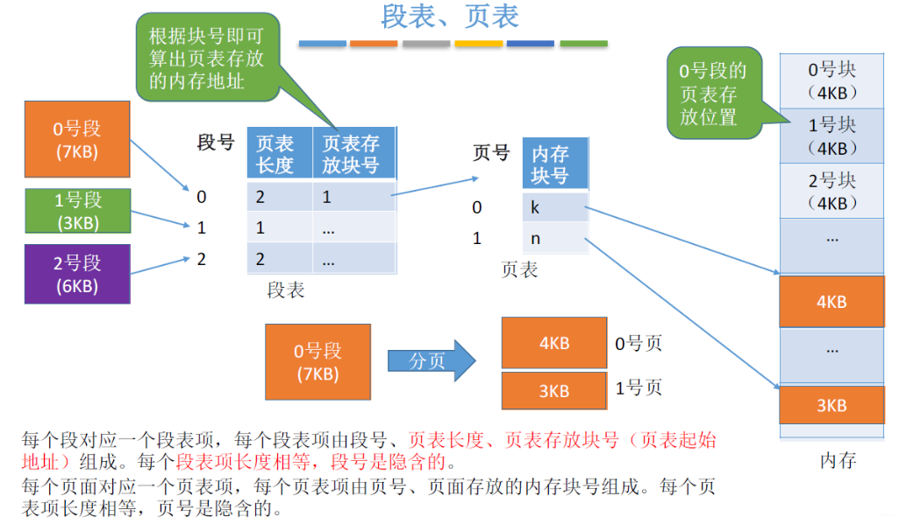

# Remind

- ==进程进入运行态时，操作系统将PCB中页表起始地址放与页表长度放入页表寄存器==

# 基本分页内存管理

## Remind

- 基础分页存储管理的思想：把进程分页，各个页面可离散地放到各个内存块中

- ==易混概念==

  - “页框、页帧、内存块、物理块、物理页”（物理地址上的内存空间）VS“页、页面”（逻辑地址上的内存空间）

  - “页框号、页帧号、内存块号、物理块号、物理页号”VS“页号、页面号”

## 页表

### Remind

- 页表记录了页面和实际存放的内存块之间的映射关系
- 一个进程对应一张页表，进程的每一页对应一个页表项
- ==i号页表项存放地址 = 页表始地址 + i × 页表项大小==

### 页表项

- 由“页号”和“块号”组成
- ==同一页表的每个页表项的大小是相同的，页号是“隐含”的==（类似数组下标访问数组内容）

### 多级页表

#### 单级页表缺陷

- 所有页表项必须连续存放，页表过大时需要很大的连续空间
- 在一段时间内并非所有页面都用得到，因此没必要让整个页表常驻内存

#### 两级页表

- 将长长的页表再分页
- 逻辑地址结构：（一级页号，二级页号，页内偏移量）
- 注意几个术语：页目录表/外层页表/顶级页表

#### 地址变换

1.  按照地址结构将逻辑地址拆分成三部分
2.  从PCB中读出页表目录始址，根据一级页号查页目录表，找到下一级页表在内存中的存放位置
3.  根据二级页号查表，找到最终想访问的内存块号
4.  结合页内偏移量得到物理地址

#### Tip

- 多级页表中，各级页表的大小不能超过一个页面。若两级页表不够，可以分更多等级
- 多级页表的访存次数（假设没有快表机构）N级页表访问一个逻辑地址需要N+1次访存

## ==逻辑地址==

- ==结构可拆分为【页号P，页内偏移量】==
  - 页号 = 逻辑地址 ÷ 页面大小
  - 页内偏移量 = 逻辑地址 % 页面大小
- 如果页面大小刚好是2的整数次幂呢？（直接位运算，比传统除法更省时间）

## 地址转换

### Remind

1. 计算出逻辑地址对应的【页号，页内偏移量】
2. 找到对应页面在内存中的存放位置（查页表）
3. 物理地址 = 页面地址（物理地址）+ 页内偏移量

### 基本地址变换机构

#### Remind

- 

#### 页表寄存器

- 存放页表起始地址
  - ==页表起始地址==是==物理地址==
- 存放页表长度

#### 地址变换过程

1. 根据逻辑地址算出页号、页内偏移量
2. 页号的合法性检查（与页表长度对比）
3. 若页号合法，在根据页表起始地址、页号找到对应页表项
4. 根据页内偏移量、页表项中记录的内存块号得到最终的物理地址
5. 访问物理内存对应的单元

#### 细节

- 页内偏移量位数与页面大小之间的关系（要能用其中一个条件推出另一个条件）
- 页式管理中地址是一维的

### 具有快表的地址变换机构

- 
- | 变换机构               | 地址变换过程                                                 | 访问一个逻辑地址的访存次数                                   |
  | ---------------------- | ------------------------------------------------------------ | ------------------------------------------------------------ |
  | 基本地址变换机构       | 1. 算页号、页内偏移量 2. 检查页号合法性 3. 查页表，找到页面存放的内存块号 4. 根据内存块号与页内偏移量得到物理地址 5. 访问目标内存单元 | 两次访存                                                     |
  | 具有快表的地址变换机构 | 1. 算页号、页内偏移量 2. 检查页号合法性 3. ==查快表==。若命中，即可知道页面存放的内存块号，可直接进行5；若未命中则进行4 4. 查页表，找到页面存放的内存块号，并且将页表项复制到快表中 5. 根据内存块号与页内偏移量得到物理地址 6. 访问目标内存单元 | - 快表==命中==，只需==一次访存== - 快表==未命中==，需要==两次访存== |

# 基本分段内存管理

## Remind

- 分段存储管理在逻辑上是断开的，每个段的逻辑地址都是从0开始（x=页内偏移量，y=段号（段名），二维信息）；而分页存储管理在逻辑上是连续的多个页公用一个逻辑地址0（x = 页号 × 页面表项大小 + 页内偏移量，一维信息）
- ==分段==比分页==更容易实现信息的共享和保护==
- 

## 分段

- 将地址空间按照程序自身的逻辑关系划分为若干个段，每段从0开始编址
- 每个段在内存中占据连续空间，但各段之间可以互不相邻
- 逻辑地址结构：【段号，段内地址】

## 段表

### Remind

- 记录逻辑段到实际存储地址的映射关系
- 每个段对应的一个段表项

### 段表项

- 由段号（隐含）、段长、基址组成
- 同一个段表中各段表项长度相同

## 地址变换

1.  由逻辑地址得到段号、段内地址
2.  段号与段表寄存器中的段长度比较，检查是否越界
3.  由段表始址、段号找到对应段表项
4.  根据段表中记录的段长，==检查段内地址是否越界==（这是与分页存储管理方式地址变换的最大不同点）
5.  由段表中的“基址+段内地址”得到最终的物理地址
6.  访问目标单元

# 基本段页式管理

## Remind

- 

## 分段+分页

- 将地址空间按照程序自身的逻辑关系划分为若干个段，在将各段分为大小相等的页面
- 将内存空间分为与页面大小相等的一个个内存块，系统以块为单位为程序分配内存
- 逻辑地址结构：【段号，页号，页内偏移量】（==地址结构是二维的==）
  - ==段号的位数决定了每个进程最多可以分几段==
  - ==页号位数决定了每个段最大有多少页==
  - ==页内偏移量决定了页面大小、内存块大小是多少==

## 段表、页表

### Remind

- 每个段对应一个段表项，每个页对应一个页表项

### 段表项

- 由段号（隐含）、==页表长度==、==页表存放地址（页表起始地址）==组成
- 同一段表中每个段表项长度相同

### 页表项

- 由页号（隐含）、==页面存放的内存块号==组成
- 同一页表中每个页表项长度相同

## 地址变换

1.  由逻辑地址得到段号、页号、页内偏移量
2.  段号与段表寄存器中的段表长度比较，检查==段号是否越界==
3.  由段表始址、段号找到对应段表项
4.  根据段表中记录的页表长度，检查==页号是否越界==
5.  由段表中的页表地址、页号得到查询页表，找到相应页表项
6.  由页面存放的内存块号、页内偏移量得到最终的物理地址
7.  访问目标单元

## 访问一个逻辑地址所需访存次数

- 第一次查段表、第二次查页表、第三次访问目标单元
- 引入快表机构，以段号和页号为关键字查询快表，即可直接找到最终的目标页面存放位置。引入快表后仅需一次访存

# Tip

## 分段对比分页

- 分页对用户不可见，分段对用户可见
- 分页地址是一纬的，分段的地址空间是二维的
- 分段更容易实现信息的共享和保护（纯代码/可重入代码可以共享）
- 分页（单级页表）、分段访问一个逻辑地址都需要两次访存，分段存储中也可以引入快表机构
