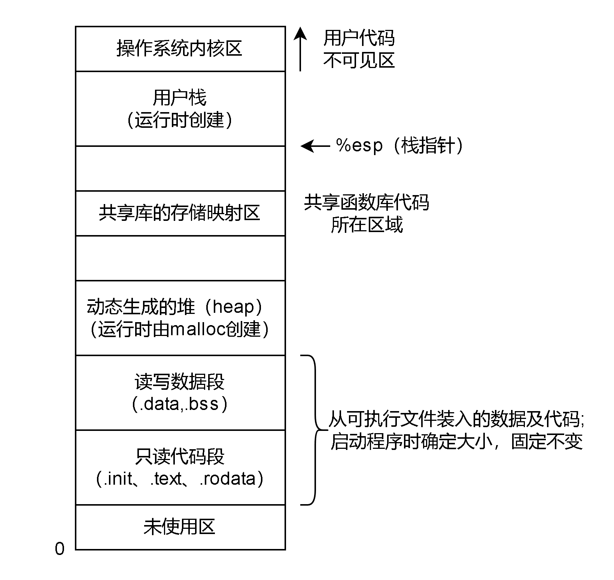

# Remind

- 线程是调度的基本单位，而进程是资源分配的基本单位。内存是资源，所以由进程管理

- 内存和定义

  - 存储单元、内存地址的概念和联系
    - 存储单元：通常以8位二进制作为一个存储单元，也就是一个字节

  - 按字节编址/按字编址

# 内存管理

## ==概念==

- > ==操作系统对内存的划分（内存映像）和动态分配==

## 作用

- 在多道程序设计中
  - 方便用户使用存储器、提高内存利用率
  - 通过虚拟技术从逻辑上扩充存储器

## 主要功能

### 内存保护

#### Remind

- > 确保每个进程都有一个单独的内存空间，保证各进程在自己的内存空间内运行，不会越界访问

#### 两种方式

- 设置一对==上、下限寄存器==，存放用户作业在主存中的==下限和上限地址==，每当CPU要访问一个地址时，分别和两个寄存器的值相比，判断==有无越界==
- 利用==界地址寄存器==和==重定位寄存器==
  - ==界地址寄存器==（又称==限长寄存器==）：存放的进程的==最大逻辑地址==
  - ==重定位寄存器==（又称==基址寄存器==）：存放的进程的==起始物理地址==
  - 内存管理机构==动态的将逻辑地址与界地址寄存器进行比较==，若无越界，则加上重定位寄存器的值后映射为物理地址，在交送内存单元

### 内存共享

- > 多个进程访问内存的同一部分

- 只能共享==只读==区域

  - 可重入代码又称==纯代码==，是一种==允许多个进程同时访问但不允许被任何进程修改的代码==，可修改的代码是不能共享的

- 在实际运行时，每个进程有自己的私有数据段，可以更改自己私有的数据段，不可改变共享的代码

- 对内存管理的总结

  - 对于==分页系统==，假设页面大小为4KB，则==代码区占用40个页面、数据区占用10个页面==。为实现代码共享，应在每个进程的页表中都建立40个页表项，它们都指向共享代码区的物理页号。此外，每个进程还要为自己的数据区建立10个页表项，指向私有数据区的物理页号
  - 对于==分段系统==，由于是以段为分配单位的，不管该段有多大，都只需为该段设置一个段表项（指向共享代码段始址，以及段长160KB）。由此可见，==段的共享非常简单易行==

### 内存分配与回收

#### 连续分配管理

- 操作系统由==单道向多道发展==时，存储管理方式便由==单一连续分配发展为固定分区分配==
- 为了更好的==适应不同大小的程序的要求，又从固定分区分配发展到动态分区分配==

#### 非连续分配管理

- 为了更好地==提高内存利用率==，进而从==连续分配发展到离散分配方式==，即==页式存储管理==
- 引入==分段存储管理==的目的，主要是为了==满足用户在编程和使用方面的要求==

### 内存的扩充（实现虚拟性）

#### Remind

- > OS利用==虚拟内存技术==或==自动覆盖技术==使得系统运行很大的程序，从逻辑上扩充内存

#### 覆盖技术

##### 一个固定区

- 存放最活跃的程序段
- 固定区中的程序段在运行过程中不会调入调出

##### 若干覆盖区

- 不可能同时被访问程序段可共享一个覆盖区
- 覆盖区中的程序段在运行过程中会根据需要调入调出

##### 缺点

- > 对用户不透明，增加了用户编程负担

##### Tip

- 必须由程序员声明覆盖结构，操作系统完成自动覆盖

#### 交换技术（针对中级调度也就是内存调度）

- 内存紧张时，换出某些进程以腾出内存空间，再换入某些进程
- 磁盘分为文件区和对换区，换出的进程放在对换区

#### Tip

##### 覆盖与交换的区别
- 覆盖是在同一个程序或进程中的
- 交换是在不同进程（或作业）之间的

### 地址转换

- > 指令、数据的逻辑地址。实现逻辑地址到物理地址的转换

# 进程的内存管理

## 进程的内存映像（在逻辑地址上，在物理地址上是离散的）

### Remind

- 

### 进程控制块（PCB）

- 存放在==系统区==

### 代码段

- > 程序的==二进制代码==，代码段是==只读==的，可==被多个进程共享==

- 内容、大小均不可变

### 数据段

- > 程序运行时==加工处理的对象==，包括==全局变量==和==静态变量==

- 内容可变，大小不可变

### 堆

- 存放==动态分配的变量==，通过调用malloc函数动态地向着高地址分配空间

### 栈

- 实现==函数调用==，从用户空间的==最大地址往低地址方向增长==

### Tip

- ==代码段==和==数据段==在程序==调入内存时就指定了大小==
- ==堆==和==用户栈==可以在运行时==动态的扩展和收缩==
  - 堆：例如调用malloc和free这样的C标准库函数时
  - 栈：每调用一个函数，栈就会增长；从一个函数返回时，栈就会收缩
- ==共享库==用于存放进程用到的==共享函数库代码==
- ==只读代码段==
  - .init：程序==初始化==时调用的_init函数
  - .text：用户程序的==机器代码==
  - .rodata：==只读数据==
- ==读/写数据段==
  - .data：==已初始化的全局变量和静态变量==
  - .bss：==未初始化及所有初始化为0==的==全局变量==和==静态变量==

## 进程构建到执行过程

### Remind

- 指令的工作原理：操作码+若干参数（可能包含地址参数）

### ==三种链接方式==

#### 静态链接：==装入前==完成符号解析，也就是不解析

#### 动态链接

- ==装入时（狭义）==动态链接：模块装完后、模块运行前符号解析（因为程序可能在运行了）
- ==运行时==动态链接：运行时需要目标模块才符号解析

### ==三种装入方式（广义，包含地址映射）==
#### 绝对装入

- > ==静态装入==+==编译时==产生绝对地址（无重定位）

#### 可重定位装入（静态重定位）

- > ==静态装入==+==静态重定位==（程序中的逻辑地址都变为物理地址，内存移动时程序中的物理地址是不变的，所以==不能移动==。且需要分配==全部连续内存空间==）

#### ==动态运行时装入（动态重定位）==

- > ==动态装入==+==动态重定位==，需设置==重定位寄存器==

### ==逻辑地址（相对地址）/物理地址（绝对地址）==

- 操作系统通过内存管理部件（MMU）将进程使用的逻辑地址转换为物理地址
  - MMU
    - TLB（快表，本身就是一块高速缓存）
    - TWU

### Tip

- 程序具体的构建到执行过程详见文档 [程序的构建与执行过程.md](..\-000-其他\程序的构建与执行过程.md) 

