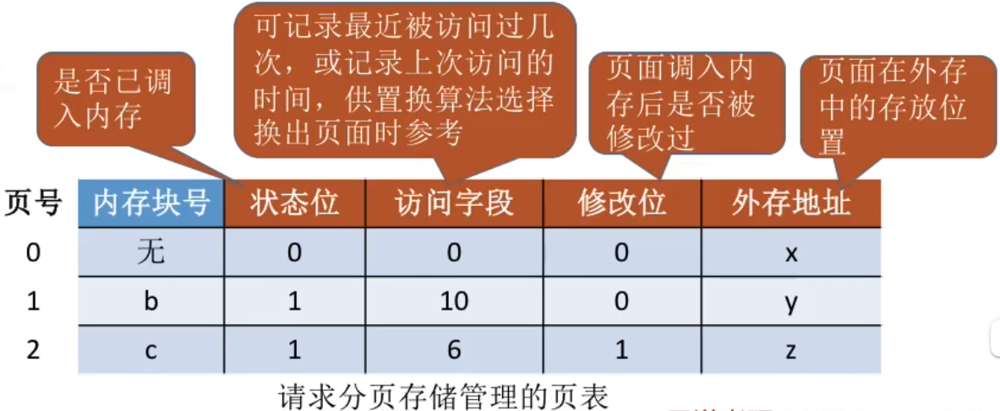
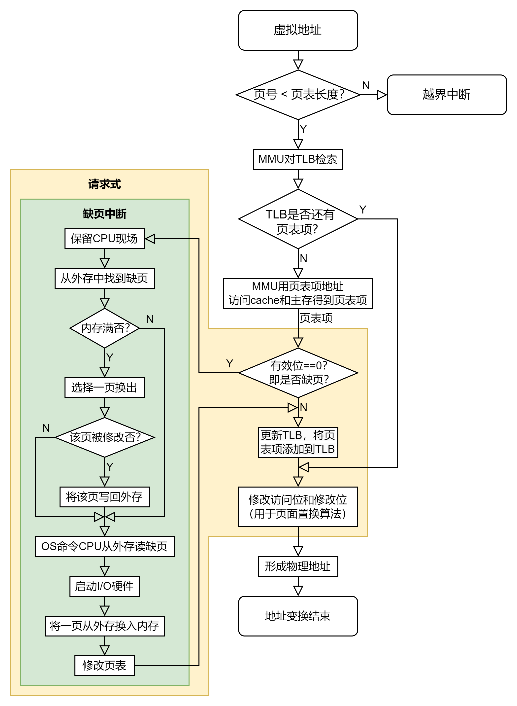
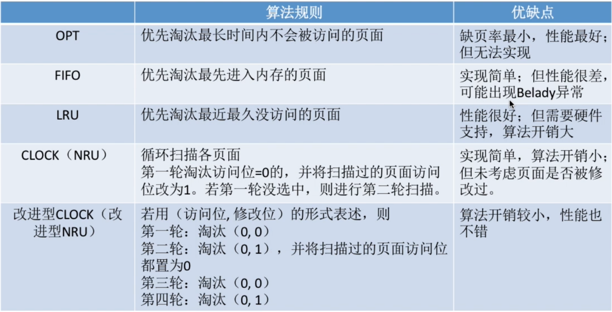

# 概述

## 传统存储管理方式的特征、缺点
### 一次性

- > ==作业必须一次性全部装入内存后才能开始运行==

- 导致大作业无法运行

- 导致多道程序并发度下降

### 驻留性

- > ==一旦作业被装入内存，就会一直驻留在内存中，直至作业运行结束==

## 虚拟内存的定义和特征

- ==虚拟内存基于局部性原理==
- 程序==不需要全部装入即可运行==，运行时根据需要动态调入数据，若内存不够，还需换出一些数据
- 特征
  - ==多次性==：无需在作业运行时一次性全部装入内存，而是允许被分成==多次调入内存==
  - ==对换性==：无需在作业运行时一直常驻内存，而是允许在作业运行过程中，==将作业换入、换出==
  - ==虚拟性==：从逻辑上扩充了内存的容量，使==用户看到的内存容量，远大于实际容量==

## 如何实现虚拟内存技术

- 访问信息不在内存时，由操作系统负责将所需信息从外存调入内存（==请求调页功能==）
- 内存空间不够时，将内存中暂时用不到的信息换出到外存（==页面置换功能==）
- 虚拟内存的实现（建立在==离散分配==（也就是非连续）的内存管理方式基础上）
  - 请求分页存储管理
  - 请求分段存储管理
  - 请求段页式存储管理
- 硬件支持
  - 一定容量的内存和外存
  - 页表机制（或段表机制），作为主要数据结构
  - 中断机构，当用户程序要访问的部分尚未调入内存时，则产生中断
  - 地址变换机构，逻辑地址到物理地址的变换

# 请求式分页管理

## 组成

### 页表机构

#### Remind
- > 页表项在基本分页的基础上增加了几个表项
- 

#### 页表项

- 内存块号：若目标页面在内存中，则是页面存放的内存块号
- 状态位（有效位）：表示页面是否已在内存中
- 访问字段：记录最近被访问过几次，或记录上次访问的时间，供置换算法选择换出页面时参考
- 修改位：表示页表调入内存后是否被修改过，只有修改过的页面才需要在置换时写回内存（一般就是写程序会修改修改位）
- 外存地址：页面在外存中存放的位置

### 缺页中断机构

- 找到页表项后检查页面是否已在内存，若没在内存，产生缺页中断
- 缺页中断处理中，需要将目标页面调入内存，有必要时还要换出页面（调入内存后，需要修改慢表，同时也需要将表项复制到快表中）
- 缺页中断属于内中断，属于内中断中的“==故障==”
- 一条指令在执行过程中可能产生多次缺页中断

### 地址变换机构

- 找到页表项是需要检查页面是否在内存中
- 若页面不在内存中，需要请求调页
- 若内存不够，还需换出页面
- 页面调入内存后，需要修改相应页表项

## ==地址变换过程==

- 

## 页面置换算法

### Remind

- 缺页率 = 缺页中断次数 ÷ 访问次数

### 最佳置换算法

- 每次选择淘汰==以后永不使用==或在==未来最长时间内不在被访问的页面==，保证最低的缺页率
- 我们并不能预知接下来会访问哪个页面，所以==最佳置换算法是无法实现的==

### 先进先出置换算法（FIFO）

- 每次选择淘汰==最早进入内存的页面==
- 实现方法：队列
- Belady异常：当为进程分配的物理块数增大时，缺页次数不减反增且==只有FIFO算法会产生Belady异常==，所以==FIFO虽然实现简单==，但==算法性能差==

### 最近最久未使用置换算法（LRU）

- 每次选择淘汰==最近最久未使用的页面==
- 实现方法：用==访问字段记录该页面自上次被访问以来所经历的时间t==
- ==性能好==，但==实现困难==，==开销大==

### 时钟置换算法（CLOCK算法或最近未使用算法）（NRU，Not Recently Used）

#### 简单的CLOCK算法

##### 实现方法

- > 将所有可能被置换的页面排成一个循环队列，并每个页面设置一个访问位。

##### 规则

- > 当某页被访问时，其访问位设为1。当需要淘汰页面时检查访问位，为0则换出；为1则设为0。换不出继续检查下一轮（因此==简单CLOCK算法淘汰一个页面最多会经过两轮扫描==）

#### 改进的时钟置换算法

##### 实现方法

- > 基于简单的CLOCK算法。==在其他条件都相同时，优先淘汰没有被修改 过的页面==，避免I/O操作。在原有访问位的基础上添加修改位，即==（访问位，修改位）==。修改位为0表示没有被修改过；为1表示被修改过。

##### 规则（（0,0）-（0,1）-（1,0）-（1,1））

1. 第一轮：从当前位置开始扫描第一个（0，0）的帧用于替换。==本轮扫描不修改任何标志位==
2. 第二轮：若第一轮失败，则重新扫描，查找第一个（0,1）的帧用于替换，并将扫描过的页面访问位置0
3. 第三轮：若第二轮失败，则重新扫描，查找第一个（0,0）的帧用于替换。==本轮不修改任何标志位==
4. 第四轮：若第三轮失败，则重新扫描，查找第一个（0，1）的帧用于替换

##### Tip

- ==改进型CLOCK置换算法最多进行四轮扫描==

### Tip

- 

## 页面分配策略

### 驻留集

- > 请求分页存储管理中给进程分配的物理块的集合

### 分配方式

#### 固定分配

- > 驻留集大小不变

#### 可变分配

- > 驻留集大小可变

### 置换方式

#### 局部置换

- > 发生缺页时只能选进程自己的物理块进行置换

#### 全局置换

- > 可以将操作系统保留的空闲物理块分配给缺页进程，也可以将别的进程持有的物理块置换到外存，再分配给缺页进程

### 页面分配、置换策略

#### 固定分配局部置换

- > 进程运行前就分配一定数量的物理块，缺页时只能换出进程自己的某一项

#### 可变分配全局置换

- > 只要缺页就分配新物理块，可能来自空闲物理块，也可能需换出别的进程页面

#### 可变分配局部置换

- > 频繁缺页的进程，多分配一些物理块；缺页率很低的进程，回收一些物理块。直到缺页率合适

### 何时调入页面

#### 预调页策略

- > 根据局部性原理，==主要用于进程的首次调入==（运行前调入）

#### 请求调页策略

- > 进程==在运行期间发现缺页时才将所缺页面调入内存==（运行时调入）

### 何处调入页面

#### Remind

##### 对换区

- > 采用连续存储方式，速度更快

##### 文件区

- > 采用离散存储方式，速度更慢

#### 对换区足够大

- > 运行将数据从文件区复制到对换区，之后所有的页面调入、调出都是在内存与对换区之间进行

#### 对换区不够大

- > 不会修改的数据每次都从文件区调入；会修改的数据调出到对换区，需要时再从对换区调入

#### UNIX方式

- > 第一次使用的页面都从文件区调入；调出的页面都写回对换区，再次使用时从对换区调入

### 抖动（颠簸）现象

#### ==抖动==（==颠簸==）

- > 频繁的页面调度行为

#### 主要原因

- > 进程频繁访问的页面数目高于可用物理块数目（==分配给进程的物理块不够==）

### 工作集

- > 在某段时间间隔里，进程实际访问页面的集合。驻留集大小一般不能小于工作集大小

# 虚拟存储器性能影响因素

## 页面大小

- 根据局部性原理，页面较大则缺页率较低，页面较小则缺页率较高

- 页面较小时，减少外部碎片，有利于提高内存利用率；但每个进程要求页面更多，页表过长，占用大量内存

- 页面较大时，减少页表长度；但内部碎片增大

## 分配给进程的物理块数量

- 物理块越多，缺页率越低，但当物理块超过某数目时，继续增加对缺页率的改善是不明显的

## 页面置换算法

## 写回磁盘的频率

- 建立一个已修改换出页面的链表，对每个要被换出的页面（已修改），可以暂不将它们写回磁盘，仅当被换出页面数达到给定值时，才将其写回磁盘

## 局部化程度

- 程序的局部化程度越高，执行时缺页率越低
