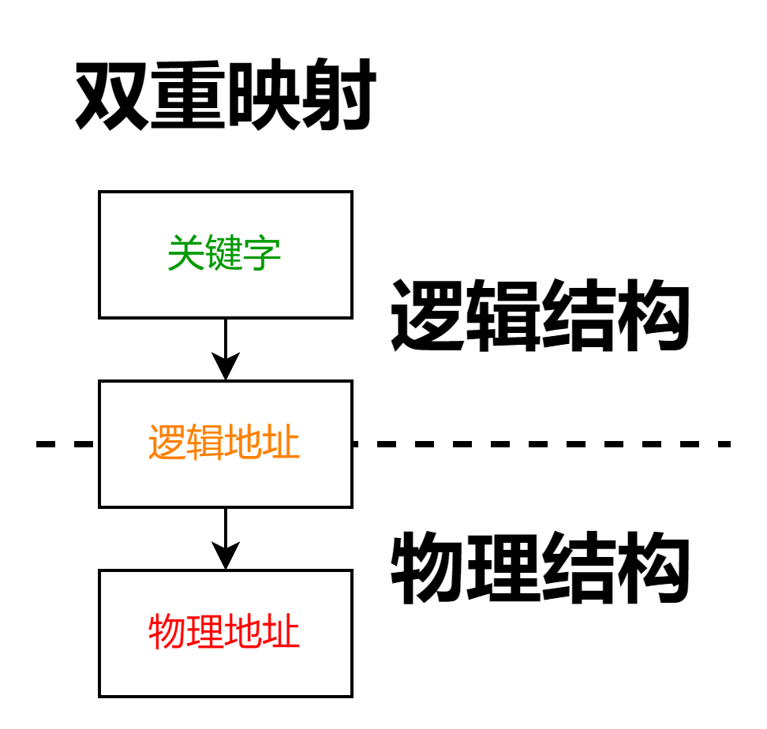

# 基本概述

## 定义

- > 一组有意义的信息的集合

## 文件的属性

- |属性|描述|
  | --- | --- |
  |==文件名==|==同一目录下不允许有重名文件==|
  |==标识符==|一个系统内的各个文件标识符唯一。操作系统用于区分文件的一种内部名  称。面相操作系统，对用户不可读|
  |==类型==|指明文件类型|
  |==位置==|文件存放的路径（面相用户）、在外存中的地址（面相操作系统，对用户不可  见）|
  |==大小==|指明文件大小|
  |==创建时间、上次修改的时间==|
  |==文件所有者信息==|
  |==保护信息==|对文件进行保护的访问控制信息|

## 文件结构

### Remind

- > 文件内部数据的组织方式

### 逻辑结构

### 物理结构

## 目录结构

- > 文件之间的组织方式
- 目录其实也是一种特殊的有结构文件（由记录组成）
- 操作系统应向上提供哪些功能（create、delete、open、close、read、write系统调用）
- 文件应如何放在外存中（文件的物理结构）
- 操作系统如何管理外存中的空缺块（存储空间的管理）
- 操作系统需要提供的其他文件管理功能

## 文件控制块（FCB，File Control Block）

### ==基本信息==

- > ==文件名==、==物理地址==、逻辑结构、物理结构等

### 存取控制信息

### 使用信息

# 索引结点

- 除了文件名之外的所有信息都放到索引结点中，每个文件对应一个索引结点
- 目录项中只包含文件名、索引结点指针，因此每个目录项的长度大幅减小
- 由于目录项长度减小，因此每个磁盘块可以存放更多个目录项，因此检索文件时磁盘I/O的次数就少了很多

# 文件的逻辑结构

## ==无结构文件==

- > 文件内部的数据就是一系列二进制或字符流组成。又称“==流式文件==”。如Windows操作系统中的.txt文件

## ==有结构文件==

### Remind

- ==由一组相似的记录组成==，又称“==记录式文件==”。

### ==记录==

- > 若干数据项组成

- ==关键字==：记录中的一个特殊数据项。当关键字不允许重复时，则关键字是记录中唯一标识或检索依据的字段

- 记录的长度

  - ==定长记录==
  - ==可变长记录==

### ==顺序文件==

#### Remind

- > 文件中的记录一个接一个地顺序排列（逻辑上），记录可以是==定长==或==可变长==的。各个记录在物理上的可以==顺序存储==或==链式存储==

#### 子结构

##### 串结构

- > 记录之间的顺序与关键字无关

##### 顺序结构

- > 记录之间的顺序按关键字顺序排列

#### 可变长记录

- 无法实现随机存取。每次只能遍历

#### 定长记录

- 可实现随机存取。记录长度为L，则第i个记录存放的相对位置是i\*L
- 采用串结构，无法快速找到某关键字对应的记录
- 采用顺序结构，可以快速找到某关键字对应的记录（如折半查找）

### ==链式文件==

- 无论定长/可变长记录，都无法实现随机存取，每次只能遍历
- ==记录保存的是下一记录的物理地址==
- ==最大缺点==：不方便增加/删除 记录

### ==索引文件==

- 建立一张索引表，每个记录对应一个表项（。各记录不用保持顺序，方便增加/删除 记录
- 若索引表按关键字顺序排列，则可支持快速检索
- ==索引表==：==定长记录的顺序文件==
- 索引项（也就是记录容）：包含关键字和逻辑地址
- ==主要用于对信息处理的及时性要求较高的场合==
- 将对记录的检索，转变成对索引文件的检索。解决了顺序文件不方便增加/删除的问题，同时让==不定长文件==实现了==随机存取==。但索引表占用很多空间

### ==索引顺序文件==

- 将==记录分组==，==每组对应一个索引表项==
- 检索记录时先顺序查索引表，找到分组，再顺序查找分组
- 当记录过多时，可建立多级索引表

# 文件的物理结构

## 顺序分配：

### Remind

- 每个文件在磁盘上占有一组连续的块
- 用户访问逻辑块号，操作系统找到该文件对应的目录项（FCB）比对块号是否合法、获取起始块号。物理块号=起始块号+逻辑块号

### ==优点==

- 支持顺序访问和直接访问（即随机访问）
- 连续分配的文件在顺序读/写时速度最快

### ==缺点==

- 文件不方便拓展
- 存储空间利用率低，会产生难以利用的磁盘碎片。可以用紧凑技术处理，但是会耗费很大的时间代价

## ==链接分配==

- > 采取离散分配的方式，为文件分配离散的磁盘块
- |链接方式|描述|==优点==|==缺点==|
  | --- | --- | --- | --- |
  |==隐式链接==|除文件最后一个盘块之外，每个盘块中都存有指向下一个盘块的指针。文件目录包括文件第一块的指针和最后一块的指针|方便文件拓展，不会有碎片问题，外存利用率高|只支持顺序访问，不支持随机访问，查找效率低，指向下一个盘块的指针也需要耗费少量的存储空间|
  |==显式链接==|把用于链接文件各物理块的指针显式地存放在一张表中，即文件分配表（==FAT==,File Allocation Table）。==一个磁盘==只会建立==一张文件分配表==。开机时文件分配表放入内存，并==常驻内存==|很方便文件拓展，不会有碎片问题，外存利用率高，并且==支持随机访问==。相比于隐式链接，==地址转换时不需要访问磁盘，因此文件访问效率更高==|文件分配表需要占用一定的存储空间|

## ==索引分配==

- > 允许文件离散地分配在各个磁盘块中，系统会==为每个文件建立一张索引表==，索引表中记录了文件的各个逻辑块对应的物理块。索引表存放的磁盘块称为==索引块==。文件数据存放的==磁盘块==称为数据块。

- 索引表项太多解决方案
  - |方案|描述|==优点==|==缺点==|
    | --- | --- | --- | --- |
    |==链接方案==|如果索引表太大，一个索引块装不下，那么可以将多个索引块链接起来存放||若文件很大，索引表很长，就需要将很多个索引块链接起来。想要找到i号索引块，必须先一次读入0~i-1号索引块，这就导致磁盘I/O次数过多，查找效率低下|
    |==多层索引==|建立多层索引（==原理类似于多级页表==）。使第一层索引块指向第二层的索引块。还可根据文件大小的要求再建立第三层、第四层索引块。采用K层索引结构，且==顶级索引表未调入内存==，则访问一个数据块只需要K+1次读磁盘操作||即使是小文件，访问一个数据块依然需要K+1次读磁盘|
    |==混合索引==|多种索引分配方式的结合。例如，一个文件的顶级索引表中，既包含==直接地址索引==，又包含==一级间接索引==、还包含==两级间接索引==|对于小文件，访问一个数据块所需的读磁盘次数更少||

- ==重要考点==

- 根据多层索引、混合索引的结构计算出文件的最大长度（==Key==：各级索引表最大不能超过一个块）

- 能自己分析访问某个数据块所需要的读磁盘次数（==Key==：FCB中会存有指向顶级索引块的指针，因此可以根据FCB读入顶级索引块。每次读入下一级的索引块都需要一次读磁盘操作。另外，要==注意题目条件：顶级索引块是否已调入内存==）

# 文件的操作

## 文件的基本操作

### 创建文件

- > 分配外存空间，创建目录项

### 删除文件

- > 回收外存空间，删除目录项

## 文件的打开与关闭

### 打开文件

- 将目录项中的信息复制到内存中的打开文件表中，并将打开文件表的索引号（也称“==文件描述符==”）返回给用户
- 打开文件之后，对文件的操作不再需要每次都查询目录，可以根据内存中的打开文件表进行操作
- 每个进程有自己的打开文件表，系统中也有一张总的打开文件表
- 进程打开文件表中特有的属性
  - |属性|描述|
    | --- | --- |
    |==文件描述符==|进程内部用于标识已打开文件的整数值，如0表示标准输入，1表示标准输出，2表示标准错误|
    |读写指针|上次进程的读写位置|
    |访问权限|只读？读写？|
- 系统打开文件表中特有的属性
  - |属性|描述|
    | --- | --- |
    |打开计数器|有多少个进程打开了该文件
    |文件磁盘位置|以便系统不必为每个操作都从磁盘上读取该信息

### 关闭文件

- 将进程打开文件表中的相应表项删除
- 系统打开文件表的打开计数器减1，若打开计数器为0，则删除系统表的表项

## 文件的读写

### 读文件

- > 根据读指针、读入数据量、内存位置将文件数据从外存读入内存

### 写文件

- > 根据写指针、写出数据量、内存位置将文件数据从内存写出外存

# 文件保护

## 口令保护

- 为文件设置一个“口令”，用户想要访问文件时需要提供口令，由系统验证口令是否正确
- 实现开销小，但“口令”一般存放在FCB或索引结点中（也就是存放在系统中）因此不太安全

## 加密保护

- 用一个“密码”对文件加密，用户想要访问文件时，需要提供相同的“密码”才能正确的解密
- 安全性高，但加密/解密需要耗费一定的时间

## 访问控制

- 用一个访问控制表（ACL，Access-Control List）记录各个用户（或各组用户）对文件的访问权限
- 对文件的访问类型可以分为：读/写/执行/添加/删除/列表清单等
- 实现灵活，可以实现复杂的文件保护功能

# 文件共享

## 基于索引结点的共享方式（硬链接）

- 各个用户的目录项指向同一个索引结点
- 索引结点中需要有链接计数count
- 某用户想删除文件时，只是删除该用户的目录项，且count--
- 只有count==0时才能真正删除文件数据和索引结点，否则会导致指针悬空

## 基于符号链的共享方式（软链接）

- 在一个Link型的文件中记录共享文件的存放路径（Windows快捷方式）
- 操作系统根据路径一层层查找目录，最终找到共享文件
- 即使软链接指向的共享文件已被删除，Link型文件依然存在，只是通过Link型文件中的路径去查找共享文件会失败（找不到对应目录项）
- 由于用软链接的方式访问共享文件时要查询多级目录，会有多次磁盘I/O，因此用软链接访问速度比硬链接慢

# Tip

## 逻辑结构与物理结构的关系

- 
- 逻辑结构
  - ==用户==视角的样子
  - 在用户看来，整个文件占用连续的逻辑地址空间
  - 文件内部的信息组织完全由用户自己决定，操作系统并不关心
- 物理结构
  - ==操作系统==决定文件采用什么物理结构存储
  - 操作系统负责将逻辑地址转变为（逻辑块号，块内偏移量）物理地址
