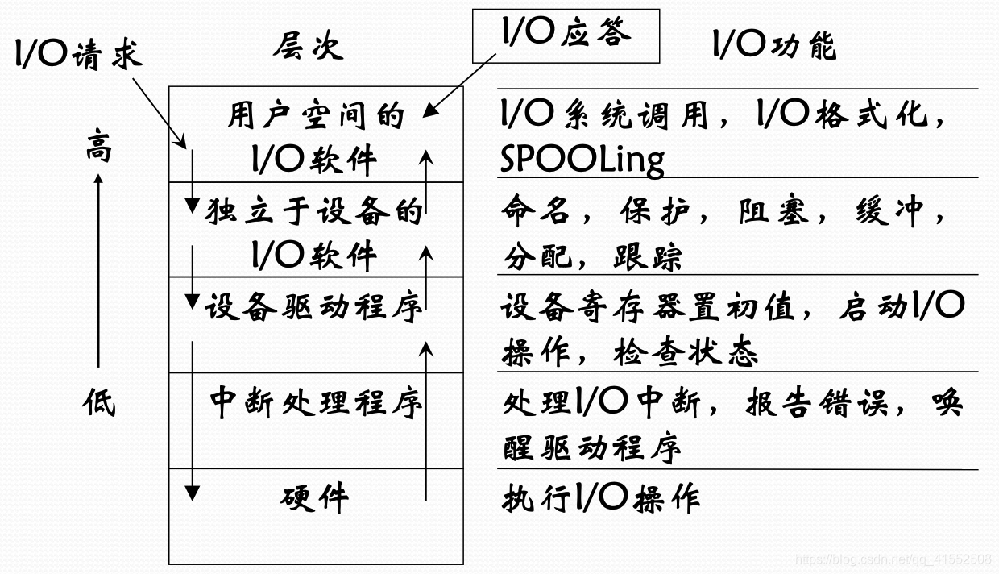
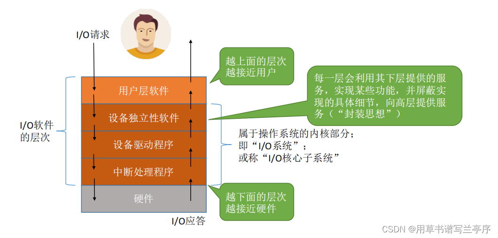
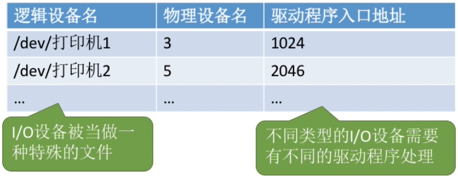
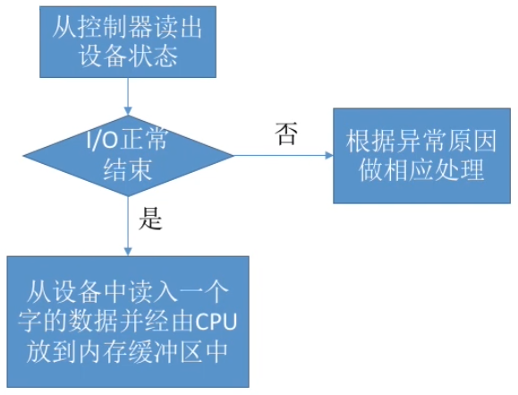

# I/O软件的实现层次

## I/O软件设计

### 设计目标

- ==高效率==：改善设备效率，尤其是磁盘I/O操作效率
- ==通用性==：用统一的标准来管理所有设备

### 设计思路

- 把软件组织成层次结构，低层软件用来屏蔽硬件细节，高层软件向用户提供简洁、友善的界面

## I/O软件层次结构

- 
- 

# I/O软件的实现

## 用户层软件

### 概述

- 用户层软件==实现了与用户交互的接口==，用户可直接使用该层提供的、与I/O操作相关的库函数对设备进行操作
- 用户层软件将用户请求翻译成格式化的I/O请求，并通过“系统调用”请求操作系统内核的服务

### 假脱机技术（SPOOLing技术)

#### 概述

- 独占式设备：只允许各进程串行使用的设备。一段时间内只能满足一个进程的请求
- 共享设备：允许多个进程“同时”使用的设备（宏观上同时使用，微观上可能是交替使用）。可同时满足多个进程的使用请求
- 独占式设备可以使用SPOOLing技术改造为共享设备，也就是设备虚拟化

#### 脱机技术实现

- 外围控制机+更高速的设备
- 作用：缓解设备与CPU的速度矛盾，实现预输入、缓输出

#### 假脱机技术实现

- 输入井和输出井：模拟脱机输入/输出时与机器速度匹配的设备
- 输入进程和输出进程：模拟脱机输入/输出时的外围控制机
- 输入缓冲区和输出缓冲区：内存中的缓冲区，输入、输出时的“中转站”

## 设备独立性软件

### 概述

- 设备独立性软件，又称设备无关性软件。与设备的硬件特性无关的功能几乎都在这一层实现
- 主要功能
  - 向上层提供统一的调用接口（如read/write系统调用）
  - 设备的保护
  - 差错处理
  - 设备的分配与回收
  - 数据缓冲区管理
  - 建立逻辑设备名到物理设备名的映射关系；根据设备类型选择调用相应的驱动程序
  - 用户或用户层软件发出I/O操作相关系统调用的系统调用时，需要指明此次要操作的I/O设备的逻辑设备名

### 设备的分配与回收

#### 设备分配时考虑的因素

##### 设备的固有属性

- 设备的固有属性可分为三种
  - 独占设备：一个时段只能分配给一个进程
  - 共享设备：可同时分配给多个进程使用，各进程往往是宏观上同时共享使用、微观上交替使用设备
  - 虚拟设备：采用SPOOLing技术将独占设备改造成虚拟的共享设备，可同时分配给多个进程使用

##### 设备的分配算法

- 详见CPU进程调度算法 [调度.md](..\-002-进程管理\调度.md) 

##### 设备分配中的安全性

- 从进程运行的安全性考虑，设备分配有两种方式（进程死锁预防）
  - 安全分配方式（静态分配策略）
    - 优点：破坏了“请求和保持”条件中“请求”条件，不会死锁
    - 缺点：对与一个进程来说，CPU和I/O设备只能串行工作
  - 不安全分配（动态分配）
    - 优点：进程的计算任务和I/O任务可以并行处理，使进程迅速推进
    - 缺点：有可能发生死锁

#### 静态分配与动态分配（进程死锁预防）

#### 设备分配管理中的数据结构

##### 设备控制表（DCT）

- 系统为每个设备配置一张DCT，用于记录设备情况
- | 设备控制表（DCT）  | 描述                                               |
  | ------------------ | -------------------------------------------------- |
  | 设备类型           | 表明设备类型                                       |
  | 设备标识符         | 物理设备名，系统中每个设备的物理设备名唯一         |
  | 设备状态           | 表明设备状态                                       |
  | 指向控制器表的指针 | 指向控制该设备的控制器                             |
  | 重复执行次数或时间 | 当重复执行多次I/O操作后仍不成功，才认为此次I/O失败 |
  | 设备队列的队首指针 | 指向正在等待该设备的进程队列（由PCB组成）          |

##### 控制器控制表（COCT）

- 每个设备控制器都会对应一张COCT。操作系统根据COCT的信息对控制器进行操作和管理

- | 控制器控制表（COCT） | 描述                                            |
  | -------------------- | ----------------------------------------------- |
  | 控制器标识符         | 各个控制器的唯一ID                              |
  | 控制器状态           | 表明控制器状态                                  |
  | 指向通道表的指针     | 指向控制该控制器的通道                          |
  | 控制器队列的队首指针 | 指向正在等待该控制器的进程队列（由PCB组成）队首 |
  | 控制器队列的队尾指针 | 指向正在等待该控制器的进程队列（由PCB组成）队尾 |

##### 通道控制表（CHCT）

- 每个通道都会对应一张CHCT

- | 通道控制表（CHCT）         | 描述                                               |
  | -------------------------- | -------------------------------------------------- |
  | 通道标识符                 | 各个通道的唯一ID                                   |
  | 通道状态                   | 表明通道状态                                       |
  | 与通道连接的控制器表首地址 | 通过该指针找到通道管理的所有控制器相关信息（COCT） |
  | 通道队列的队首指针         | 指向正在等待该通道的进程队列（由PCB组成）队首      |
  | 通道队列的队尾指针         | 指向正在等待该通道的进程队列（由PCB组成）队尾      |

##### 系统设备表（SDT）

- 记录了==系统中全部设备==的情况，每个设备对应一个表目

- | 表目                     |
  | ------------------------ |
  | 设备类型                 |
  | 设备标识符（物理设备名） |
  | DCT（设备控制表）        |
  | 驱动程序入口             |

#### 设备分配的步骤

- 原步骤

  1. 根据进程请求的==物理设备名==查找SDT（物理设备名是进程请求分配设备时提供的参数）
  2. 根据SDT找到DCT，若==设备==忙碌则将进程PCB挂到==设备等待队列==中，不忙碌则将==设备==分配进程
  3. 根据DCT找到COCT，若==控制器==忙碌则将进程PCB挂到==控制器等待队列==中，不忙碌则将==控制器==分配给进程
  4. 根据COCT找到CHCT，若==通道==忙碌则将进程PCB挂到==通道等待队列==中，不忙碌则将==通道==分配给进程

- 缺点

  - 用户编程时必须使用物理设备名，底层细节对用户不透明，不方便编程

  - 若换了一个物理设备，则程序无法运行

  - 若进程请求的物理设备正在忙碌，则即使系统中还有同类型的设备，进程也必须阻塞等待

- 改进方法：建立逻辑设备名与物理设备名的映射机制，用户编程时只需要提供逻辑设备名

- 改进步骤

  1. 根据进程请求的==逻辑设备名==查找SDT（==用户编程时提供的逻辑设备名其实就是设备类型==）
  2. 查找SDT，找到用户进程==指定类型的、并且空闲==的设备，将其分配给该进程。操作系统==在逻辑设备表（LUT）中新增一个表项==
  3. 根据DCT找到COCT，若控制器忙碌则将进程PCB挂到控制器等待队列中，不忙碌则将控制器分配给进程
  4. 根据COCT找到CHCT，若通道忙碌则将进程PCB挂到通道等待队列中，不忙碌则将通道分配给进程
- 设备独立性软件需要通过==逻辑设备表（LUT，Logical UnitTable）==来确定逻辑设备对应的==物理设备==，并找到该设备对应的==设备驱动程序==
- 
- 操作系统可以采用两种方式管理逻辑设备表（LUT）
  - ==整个系统只设置一张LUT==，这就意味着所有用户不能使用相同的逻辑设备名，因此这种方式只适用于单用户操作系统
  - ==为每个用户设置一张LUT==，各个用户使用的逻辑设备名可以重复，适用于多用户操作系统。系统会在用户登录时为其建立一个用户管理进程，而LUT就存放在用户管理进程的PCB中

### 缓冲区管理

#### 概念

- 一般利用内存作为缓冲区
- 缓解CPU与设备的速度矛盾、减少对CPU的中断频率、解决数据颗粒度不匹配的问题、提高CPU与I/O设备之间的并行性
- ==缓冲区非空，不能传入数据，只能传出数据；缓冲区为空，只能传入数据且必须充满缓冲区，缓冲区才能传出数据==

#### 单缓冲

- 设备只有一个缓冲区（若无特殊说明，一个缓冲区大小默认一个块）

#### 双缓冲

- 设备有两个缓冲区（无特殊说明，一个缓冲区大小默认一个块）

#### 循环缓冲区

- 设备拥有多个==大小相等==的缓冲区链接成的一个==循环队列==

#### 缓冲池

- ==缓冲池==由系统中共用的缓冲区组成。这些缓冲区按使用状况可分为
  - 空缓冲队列
  - 装满输入数据的缓冲队列
  - 装满输出数据的缓冲队列

## 设备驱动程序

- ==直接与硬件打交道==。主要负责对硬件设备的具体控制，将上层发出的一系列命令转化成特定设备“能听懂”的一些列操作。包括设置设备寄存器，检查设备状态等
- 不同的I/O设备有不同的硬件特性，具体细节只有设备的厂家才知道。因此厂家需要根据设备的硬件特性设计并提供相应的驱动程序

## 中断处理程序

- ==直接与硬件打交道==。当I/O任务完成时，I/O控制器会发送一个==中断信号==，系统会==根据中断信号类型==找到相应的==中断处理程序==并执行
- 

# I/O软件接口

## 设备独立性软件接口

### 概述

- 设备独立性软件提供给用户层软件的接口

### 按设备类型分类

#### 字符设备接口

- get/put系统调用：向字符设备读/写一个字符

#### 块设备接口

- read/write系统调用：向块设备的==读写指针位置==读/写多个字符
- seek系统调用：==修改读写指针位置==

#### 网络设备接口

- 网络设备接口，又称“==网络套接字（socket）接口==”
- socket系统调用：==创建一个网络套接字==，需指明网络协议（TCP？UDP？）
- bind：将套接字绑定到某个本地“==端口==”
- connect：将套接字连接到远程地址
- read/write：从套接字读/写数据

### 按模式分类

#### ==阻塞I/O==

- 应用程序发出I/O系统调用，==进程需转为阻塞态等待==。例如：字符设备接口从键盘读一个字符get

#### ==非阻塞I/O==

- 应用程序发出I/O系统调用，系统调用可迅速返回，==进程无需阻塞等待==。例如：块设备接口往磁盘写数据write

##  设备驱动程序接口

- 设备驱动程序提供给设备独立性软件的接口
- 若各公司开发的驱动设备程序接口不统一，则操作系统很难调用设备驱动程序。所以需要==统一标准的设备驱动程序接口==，操作系统规定好设备驱动程序的接口标准，各厂商必须按要求开发设备驱动程序