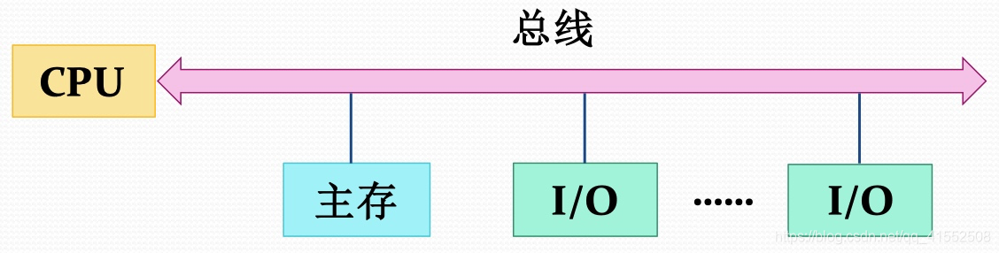
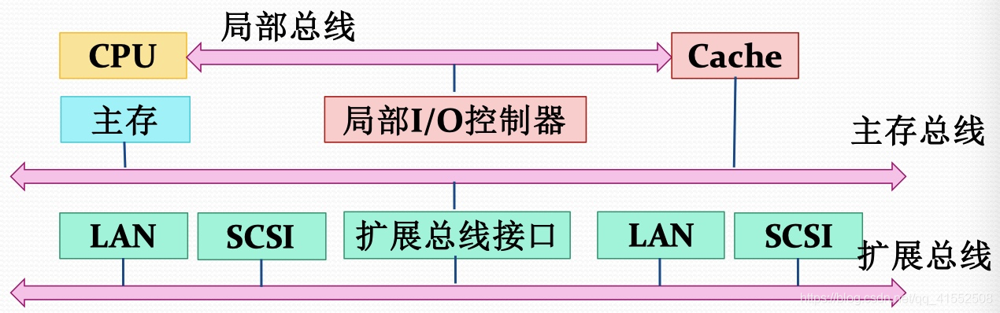
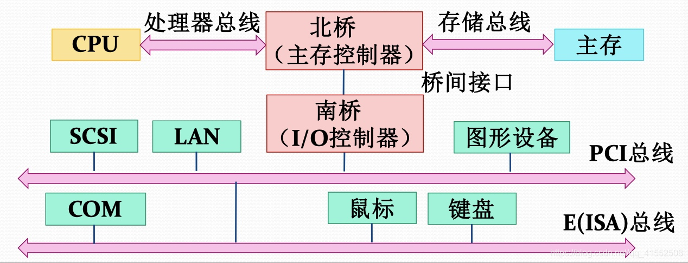
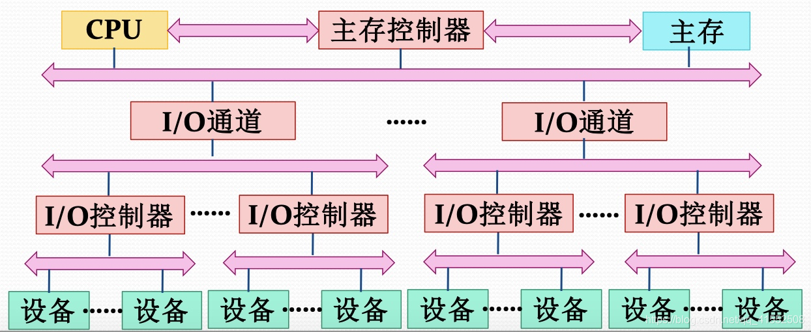

# 总线概述

- 总线目标：解决I/O速度不匹配问题
- 总线连接方式不同，会导致计算机性能的巨大差异，从而导致计算机价格的巨大差异。只有合理地组织总线，才能使得处理器和设备充分并行，提高系统效率

# 常见总线结构

## 单总线

### 总线结构

- 将CPU、主存和I/O模块连接到同一组总线上

### 优点

- 结构简单、易于扩充

### 缺点

- 主存需要和I/O模块公用总线
- 设备增多会造成总线变长，进而增加传输时延
- 无法适用于大量高速设备

### Tip

- 

## 传统的三级总线

### 总线结构

- 主存和Cache通过主存总线传送数据，主存总线和扩展总线上的设备之间传送数据通过扩展总线接口缓冲

### 优点

- 主存与I/O之间的数据传送与处理器的活动分离
- 可以支持更多的I/O设备

### 缺点

- 不适用于I/O设备数据速率相差太大的情形

### Tip

- 

## 南北桥多级总线

### 总线结构

- 通过存储总线、PCI总线、E（ISA）总线分别连接主存、高速I/O设备和低速I/O设备

### 优点

- 可以支持不同数据速率的I/O设备

### Tip

- 

## I/O通道多级总线

### 总线结构

- 支持CPU、主存和多个I/O通道之间的数据传送
- 支持I/O通道和I/O控制器，以及I/O控制器和设备之间的数据传送

### Tip

- 