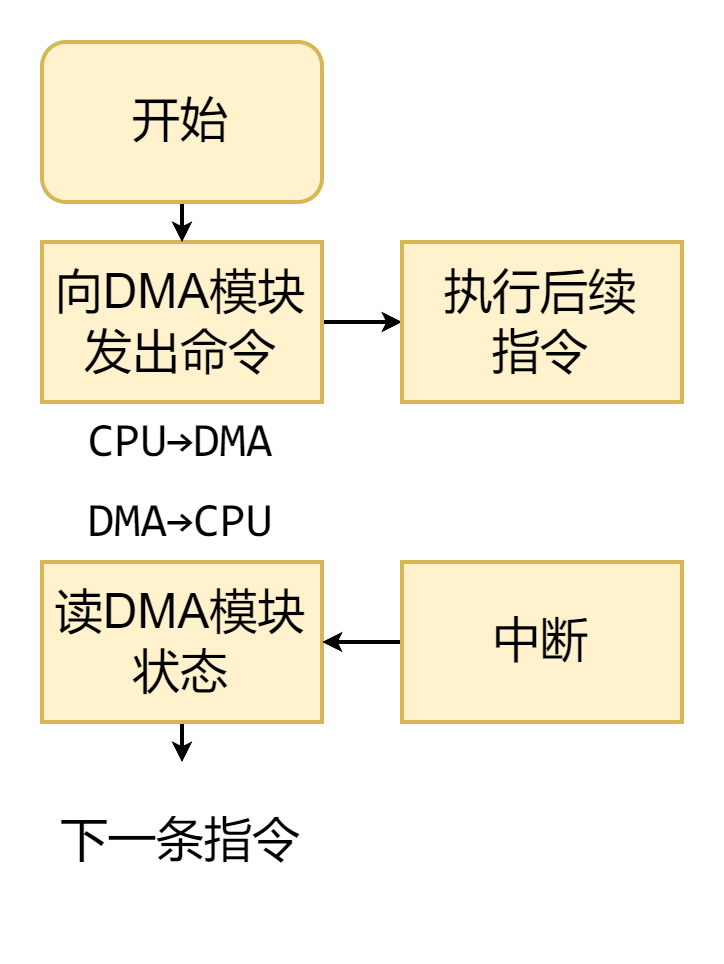

# I/O接口（设备控制器）

## 概述

- 将I/O设备中的机械部件与电子部件分开处理，其中电子部件称为设备控制器
- OS与控制器交互，而非与设备交互

## 主要功能

- 接受和识别CPU发出的命令（来自CPU或通道）：==控制寄存器==
- 记录设备的状态（供CPU处理）：==状态寄存器==
- 数据交换：==数据寄存器==
- 设备地址识别（连接多台设备时）

## 组成

- 与主机交互
  - CPU与控制器之间的接口（实现控制器与CPU之间的通信，数据交换，获取设备状态）
  - I/O逻辑（负责识别CPU发出的命令，并向设备发出命令）
- 与设备交互
  - 控制器与设备之间的接口（实现控制器与设备之间的通信）

## 类型

### 按数据传送方式

- 并行接口
- 串行接口

### 按主机访问I/O设备的控制方式

- 程序查询接口
- 中断
- DMA接口
- 等等

### 按功能选择的灵活性

- 可编程接口：通过编程改变接口功能
- 不可编程接口

## Tip

- 

# 控制方式

## 程序直接控制方式（轮询方式）

### 具体流程

- 程序直接控制方式是忙则等待的过程
  1. 处理器向控制器发送一个I/O命令
  2. 反复查看I/O状态，直至数据交换就绪
  3. 执行数据交换
- 

### 特点

- 处理I/O请求会终止原程序的执行
- CPU需要参与数据传送
- CPU与设备串行工作，效率低下

## 中断方式

### 具体流程

- 中断方式是忙则挂起的过程
  1. 处理器向控制器发出I/O命令，然后继续执行后续指令
     - 如果该进程支持异步I/O，则继续执行该进程
     - 否则，进程在这个中断点挂起，CPU执行其他程序
  2. 控制器检查设备状态，就绪后发起中断
  3. CPU响应中断，转向中断处理程序
  4. 中断处理程序执行数据交互
  5. 恢复执行原先程序
- 

### 特点

- CPU不需要等待I/O设备就绪
- CPU仍需要参与数据传送（响应中断后，原程序会停止执行）
- CPU和设备部分并行，效率提高

## DMA方式

### DMA模块

- 直接存储器访问
- 模仿处理器来控制主存和设备控制器之间的数据交换
- 

### 具体流程

- DMA方式是任务指派过程
  1. 处理器向DMA模块发出I/O命令
  2. 处理器继续执行其它工作，DMA模块负责传送全部数据
  3. 数据传送结束后，DMA中断处理器
- 

### 特点

- CPU不会终止原程序的执行（CPU无需等待I/O设备就绪，也无需进行数据交换）
- CPU只在数据传送的开始和结束时参与
  - 开始时，CPU需要对DMA模块进行初始化
  - 结束时，CPU响应中断，但不必保存现场

### 周期窃取

- 当DMA和CPU同时经总线访问内存时，CPU总是将总线的占有权让给DMA一个或几个主存周期
- CPU大部分情况下与Cache进行数据交换，因此周期窃取对CPU与主存的数据交换速率影响不大
- 

## I/O通道

### 概述

- I/O通道，又称通道控制器、I/O处理器
- 设备控制器包含==自身专用的处理器==和通道程序
- I/O指令不再由处理器执行，而是存在主存中，由I/O通道所包含的处理器执行
- 采用四级结构，==处理器-通道-控制器-设备==
- CPU与通道并行工作

### 带有局部存储器的I/O通道

- 相当于一台自治的计算机
  - I/O指令存储在控制器自带的局部存储器中，并由I/O通道所包含的处理器执行
- 可以控制大量的I/O设备，同时最小化CPU的干涉
- 常用于交互式终端通信，负责包括控制终端在内的大部分任务

### 流程

1. CPU遇到I/O请求，启动指定通道
2. 一旦启动成功，通道开始控制I/O设备进行操作，CPU执行其他任务
3. I/O操作完成后，I/O通道发出中断，CPU停止当前工作，转向处理I/O操作结束事件

## Tip

- |                                                       | 完成一次读/写的过程                                          | CPU干预频率 | 每次I/O的数据传输单位 | 数据流向                                 | 优缺点                                                       |
  | ----------------------------------------------------- | ------------------------------------------------------------ | ----------- | --------------------- | ---------------------------------------- | ------------------------------------------------------------ |
  | 程序直接控制方式                                      | CPU发出I/O命令后需要不断轮询                                 | 极高        | 字节                  | - 设备->CPU->内存 - 内存->CPU->设备 | 每个阶段的优点都是解决上一个阶段的最大缺点                   |
  | 中断驱动方式                                          | CPU发出I/O命令后可以做其他事，本次I/O完成后设备控制器发出中断信号 | 高          | 字节                  | - 设备->CPU->内存 - 内存->CPU->设备 | 总体来说，整个发展过程就是要尽量减少CPU对I/O过程的干预       |
  | DMA方式                                               | CPU发出I/O命令后可以做其他事，本次I/O完成后DMA控制器发出中断信号 | 中          | 块                    | - 设备->内存 - 内存->设备           | 把CPU从繁杂的I/O控制事务中解脱出来，以便更多的去完成数据处理任务 |
  | 通道控制方式（通道：一种硬件，可以理解为“弱鸡版CPU”） | CPU发出I/O命令后可以做其他事。通道会执行通道程序以完成I/O，完成后通道发出中断信号 | 低          | 一组块                | - 设备->内存 - 内存->设备           |                                                              |

  - DMA方式中DMA硬件会占用数据总线和地址总线。所以实际上节省时间的核心是在于，软件实现的数据传输功能改为DMA硬件电路实现。这种硬件加速提高了效率